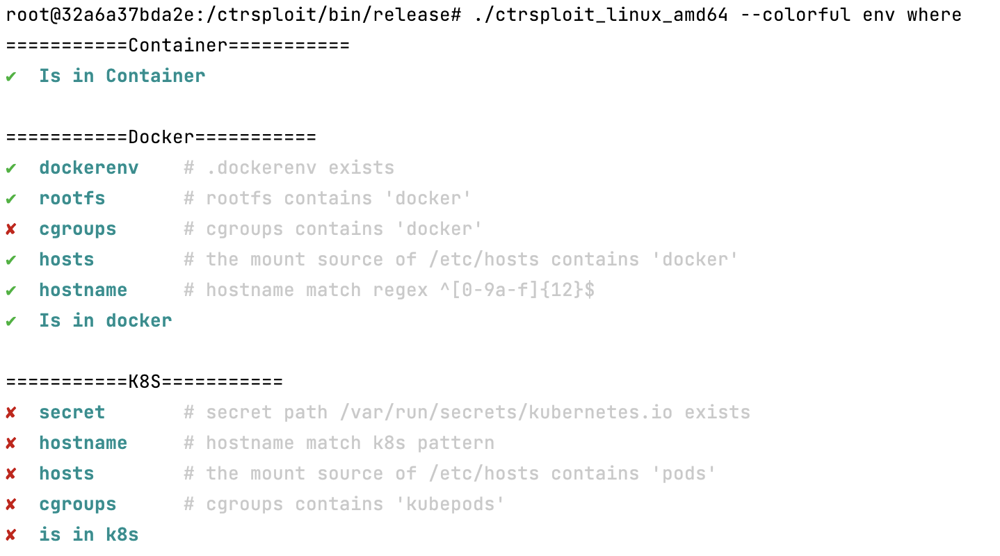

---

version: v0.5.0

---

# Sploit Specification

## 1. Top level commands

| Commands     | Alias | Description                                              |
|--------------|-------|----------------------------------------------------------|
| env          | e     | information collection                                   |
| exploit      | x     | run a exploit                                            |
| checksec     | c     | detect vulnerabilities                                   |
| vul          | v     | list vulnerabilities                                     |
| auto         | a     | auto gathering information, and detect vuls, and exploit |
| version      | -     | show sploit tool's version                               |
| spec-version | -     | show which spec does the sploit tool use                 |

### 1.1 version command

execute `xsploit version`, output:

`xsploit <license: [public|pro|...]> version v0.0.1[+dev], build <gitcommit> at <datetime>`

* `license` can be public, pro, or any other value you want
* `version` follows [Semantic Versioning 2.0.0](https://semver.org/spec/v2.0.0.html)
* `gitcommit` is the first 7 characters of the latest commit's hash
* `datetime` follows the RFC3339 format

e.g.
```
$ ctrsploit version
ctrsploit public version v0.5.0+dev, build 6165b8e at 2023-05-31T07:36:02Z
```

### 1.2 checksec command

check vulnerability exists

e.g.

```
❯ ./bin/release/xsploit_linux_amd64 checksec     
NAME:
   xsploit checksec - check security inside a container

USAGE:
   xsploit checksec command [command options] [arguments...]

COMMANDS:
   auto                 auto
   CVE-2099-9999, 2099  Description of CVE-2099-9999
   help, h              Shows a list of commands or help for one command

OPTIONS:
   --help, -h  show help

❯ ./bin/release/xsploit_linux_amd64 checksec 2099
[Y]  CVE-2099-9999      # Description of CVE-2099-9999
❯ ./bin/release/xsploit_linux_amd64 --json checksec 2099
{"name":"CVE-2099-9999","description":"Description of CVE-2099-9999","result":false}
❯ ./bin/release/xsploit_linux_amd64 --json checksec auto
{"CVE-2099-9999":{"name":"CVE-2099-9999","description":"Description of CVE-2099-9999","result":true}}
```

> There can be submodules under checksec. e.g. checksec mysql CVE-2088-8888

checksec can also be a single binary thanks to [Command2App()](./pkg/app/command.go)

```
❯ .checksec_linux_amd64 --json a
{"CVE-2099-9999":{"name":"CVE-2099-9999","description":"Description of CVE-2099-9999","result":true}}
```

#### 1.2.1 Vulnerability

Vulnerability is an interface provide these methods:

[github.com/ctrsploit/sploit-spec/pkg/vul.Vulnerability](https://github.com/ctrsploit/sploit-spec/blob/main/pkg/vul/vul.go#L13)

```go
type Vulnerability interface {
	// GetName returns a one word name; may be used as command name
	GetName() string
	// GetDescription return usage
	GetDescription() string
	GetVulnerabilityExists() bool
	Info()
	// CheckSec whether vulnerability exists
	CheckSec() (bool, error)
	// Output shows checksec result
	Output()
	// Exploitable whether vulnerability can be exploited,
	// will be called automatically before Exploit()
	Exploitable() (bool, error)
	Exploit() (err error)
}
```

What developer should do is implement a Vulnerability object, and convert it to a cli.Command.

```go
var Command = &cli.Command{
	Name:    "checksec",
	Aliases: []string{"c"},
	Usage:   "check security inside a container",
	Subcommands: []*cli.Command{
		app.Vul2ChecksecCmd(vul.CVE_2099_9999_v1, []string{"2099"}),
	},
}
```

```go
var (
	CVE_2099_9999_v1 = &CVE_2099_9999{
		vul.BaseVulnerability{
			Name:        "CVE-2099-9999",
			Description: "Description of CVE-2099-9999",
			CheckSecPrerequisites: prerequisite.Prerequisites{
				&prerequisite2.EvenTime,
			},
			ExploitablePrerequisites: prerequisite.Prerequisites{
				&user.MustBeRoot,
			},
		},
	}
)

func (cve CVE_2099_9999) Exploit() (err error) {
	err = cve.BaseVulnerability.Exploit()
	if err != nil {
		return
	}
	fmt.Println("CVE-2099-9999 has exploited")
	return
}
```

There's a 'BaseClass' BaseVulnerability implemented some methods:

[github.com/ctrsploit/sploit-spec/pkg/vul.BaseVulnerability](https://github.com/ctrsploit/sploit-spec/blob/main/pkg/vul/vul.go#L30)

```go
type BaseVulnerability struct {
	Name                     string                     `json:"name"`
	Description              string                     `json:"description"`
	VulnerabilityExists      bool                       `json:"vulnerability_exists"`
	CheckSecHaveRan          bool                       `json:"-"`
	CheckSecPrerequisites    prerequisite.Prerequisites `json:"-"`
	ExploitablePrerequisites prerequisite.Prerequisites `json:"-"`
}

func (v *BaseVulnerability) CheckSec() (vulnerabilityExists bool, err error) {
    vulnerabilityExists, err = v.CheckSecPrerequisites.Satisfied()
    if err != nil {
        return
    }
    v.VulnerabilityExists = vulnerabilityExists
    v.CheckSecHaveRan = true
    return
}
```

Vulnerability has two types of prerequisite:

1. Whether vulnerability exists?
2. Whether vulnerability can be exploited? (We may do not require permissions to execute exploit but the vulnerability exists)

CheckSec method actually check the first type prerequisite.

#### 1.2.2 prerequisite

Prerequisite is an Interface provide these methods:

[github.com/ctrsploit/sploit-spec/pkg/prerequisite.Interface](https://github.com/ctrsploit/sploit-spec/blob/main/pkg/prerequisite/prerequisite.go#L11)

```go
type Interface interface {
	Check() error
	Output()
	GetSatisfied() bool
}
```

What developer should do is implement a Prerequisite object.

e.g.

[github.com/ctrsploit/sploit-spec/pkg/prerequisite/user](https://github.com/ctrsploit/sploit-spec/blob/main/pkg/prerequisite/user/user.go#L10)

```go
type MustBe struct {
	ExpectedUser uint
	prerequisite.BasePrerequisite
}

func (p *MustBe) Check() (err error) {
    err = p.BasePrerequisite.Check()
    if err != nil {
        return
    }
    current, err := user.Current()
    if err != nil {
        awesome_error.CheckErr(err)
        return
    }
    u, err := strconv.Atoi(current.Uid)
    if err != nil {
        awesome_error.CheckErr(err)
        return
    }
    p.Satisfied = uint(u) == p.ExpectedUser
    return
}
```

### 1.3 env

The env list to be collected:

* [app](./env-app.md)
* [container](./env-container.md)
* [linux](./env-linux.md)
* [virt](./env-virt.md)

#### upload

upload env info to obs.

register the upload subcommand to env command
```go
Upload = upload.GenerateUploadCommand(func() (content []byte, err error) {
    env := auto.Auto()
    content, err = json.Marshal(env)
    if err != nil {
        return
    }
    return
})
```

The upload subcommand has 4 Arguments, including servicename, filename, obsurl, obshots
```go
//eg. ECS
servicename := context.Args().Get(0)
// region_tag.json eg. cn-north4_linux.json
filename := context.Args().Get(1)
// obsurl
obs := context.Args().Get(2)
// obshost (if want to hide obs upload behavior), put your real obsurl in here, put the fake url in obsurl
host := context.Args().Get(3)
if servicename == "" {
    return
}
```
- servicename: like ECS\CCE
- filename: tag_region.json (cn-north4_linux.json)
- obs: the target obs url
- host(optional): If you want to hide the obs upload behaviro, Put the real obs url in here, and put the fake url in obsurl.

finally, the subcommand is like:
```
xsploit env upload local cn-north7_linux.json http://xxx.com aaa.com
```

### 1.4 exploit command

### 1.5 vul command

```
$ ./bin/latest/ctrsploit_linux_amd64 vul
NAME:
   ctrsploit vul - check security inside a container

USAGE:
   ctrsploit vul [command options]

COMMANDS:
   CVE-2025-47290, 47290, cve-2025-47290                           TOCTOU vulnerability in containerd that allows modification of the host filesystem during image pull.
   help, h                                                         Shows a list of commands or help for one command

OPTIONS:
   --help, -h  show help

$ ./bin/latest/ctrsploit_linux_amd64 vul 47290
NAME:
   ctrsploit vul CVE-2025-47290 - TOCTOU vulnerability in containerd that allows modification of the host filesystem during image pull.

USAGE:
   ctrsploit vul CVE-2025-47290 [command options]

COMMANDS:
   checksec, c  check vulnerability exists
   exploit, x   run exploit
   help, h      Shows a list of commands or help for one command

OPTIONS:
   --help, -h  show help
```

Vul2Command

https://github.com/ctrsploit/sploit-spec/blob/main/pkg/app/vul.go

```
func Vul2VulCmd(v vul.Vulnerability, alias []string, flagsCheckSec []cli.Flag, flagsExploit []cli.Flag, checkBeforeExploit bool) *cli.Command {
	checksec := Vul2ChecksecCmd(v, []string{"c"}, flagsCheckSec)
	checksec.Name = "checksec"
	checksec.Usage = "check vulnerability exists"

	exploit := Vul2ExploitCmd(v, []string{"x"}, flagsExploit, checkBeforeExploit)
	exploit.Name = "exploit"
	exploit.Usage = "run exploit"
	return &cli.Command{
		Name:    v.GetName(),
		Aliases: alias,
		Usage:   v.GetDescription(),
		Subcommands: []*cli.Command{
			checksec,
			exploit,
		},
	}
}
```

e.g.:

* https://github.com/ctrsploit/ctrsploit/blob/v0.9.0/vul/cve-2016-8867/vul.go#L14
* https://github.com/ctrsploit/ctrsploit/blob/v0.9.0/vul/cve-2020-15257/vul.go#L19

## 2. suggested file structure

According to https://github.com/golang-standards/project-layout:

* /bin: contains the built binary
    * /release
* /cmd
    * /xsploit/: the cli directory
        * /env/: top level command env and it's subcommands' cli.Command definition
        * /exploit/: top level command exploit and it's subcommands' cli.Command definition
        * /checksec/: top level command checksec and it's subcommands' cli.Command definition
        * /auto/: top level command auto and it's subcommands' cli.Command definition
        * /version/: top level command version and it's subcommands' cli.Command definition
* /env/: env implementations
* /exploit/: exploit implementations
* /checksec/: checksec implementations
* /version: a file contains version information
* /test/: Additional external test apps and test data.
* /pkg/: Library code that's ok to use by external applications.

## 3. json/text/colorful output mode

x-sploit provide 3 output options:

```
GLOBAL OPTIONS:
   --colorful  output colorfully (default: false)
   --json      output colorfully (default: false)
```

Usage

```
x-sploit --colorful subcommands
```

E.g.



Coding examples see 
* [/pkg/printer/printer_example_test.go](https://github.com/ctrsploit/sploit-spec/blob/main/pkg/printer/printer_example_test.go)
* [/example/xsploit/env/auto.go](https://github.com/ctrsploit/sploit-spec/blob/main/example/xsploit/env/auto.go)
