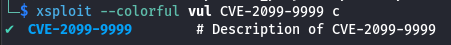

---

version: v0.7.0

---

# Sploit Specification

## 1. Top level commands

| Commands     | Alias | Description                                              |
|--------------|-------|----------------------------------------------------------|
| version      | -     | show sploit tool's version                               |
| spec-version | -     | show which spec does the sploit tool use                 |
| env          | e     | information collection                                   |
| exploit      | x     | run a exploit                                            |
| checksec     | c     | detect vulnerabilities                                   |
| vul          | v     | list vulnerabilities                                     |
| auto         | a     | auto gathering information, and detect vuls, and exploit |

### 1.1 version command

execute `xsploit version`, output:

`xsploit <license: [public|pro|...]> version v0.0.1[+dev], build <gitcommit> at <datetime>`

* `license` can be public, pro, or any other value you want
* `version` follows [Semantic Versioning 2.0.0](https://semver.org/spec/v2.0.0.html)
* `gitcommit` is the first 7 characters of the latest commit's hash
* `datetime` follows the RFC3339 format

e.g.

```shell
$ ctrsploit version
ctrsploit public version v0.5.0+dev, build 6165b8e at 2023-05-31T07:36:02Z
```

### 1.2 spec-version command

execute `spec-version`, output:

`vx.x.x`

e.g.

```shell
$ ctrsploit spec-version
v0.7.0
```

### 1.3 env command

The env list to be collected:

* [app](./env/app.md)
* [container](./env/container.md)
* [linux](./env/linux.md)
* [virt](./env/virt.md)

The definition of these env information can be used as a golang package: [github.com/ctrsploit/sploit-spec/pkg/env](https://github.com/ctrsploit/sploit-spec/tree/main/pkg/env)

#### 1.3.1 upload command

upload env info to a bucket.

register the upload subcommand to env command

```go
Upload = upload.GenerateUploadCommand(
	func () (content []byte, err error) {
        env := auto.Auto()
        content, err = json.Marshal(env)
        if err != nil {
            return
        }
        return
    }
)
```

The upload subcommand has 4 Arguments, including servicename, filename, obsurl, obshots

```go
//eg. ECS
servicename := context.Args().Get(0)
// region_tag.json eg. cn-north4_linux.json
filename := context.Args().Get(1)
// obsurl
obs := context.Args().Get(2)
// obshost (if want to hide obs upload behavior), put your real obsurl in here, put the fake url in obsurl
host := context.Args().Get(3)
if servicename == "" {
    return
}
```

- servicename: like ECS\CCE
- filename: tag_region.json (cn-north4_linux.json)
- obs: the target obs url
- host(optional): If you want to hide the obs upload behaviro, Put the real obs url in here, and put the fake url in obsurl.

finally, the subcommand is like:

```
xsploit env upload local xxx.json http://xxx.com aaa.com
```

### 1.4 checksec command

checksec command checks vulnerability exists

e.g.

```
❯ ./bin/release/xsploit_linux_amd64 checksec     
NAME:
   xsploit checksec - check security inside a container

USAGE:
   xsploit checksec command [command options] [arguments...]

COMMANDS:
   auto                 auto
   CVE-2099-9999, 2099  Description of CVE-2099-9999
   help, h              Shows a list of commands or help for one command

OPTIONS:
   --help, -h  show help

❯ ./bin/release/xsploit_linux_amd64 checksec 2099
[Y]  CVE-2099-9999      # Description of CVE-2099-9999
❯ ./bin/release/xsploit_linux_amd64 --json checksec 2099
{"name":"CVE-2099-9999","description":"Description of CVE-2099-9999","result":false}
❯ ./bin/release/xsploit_linux_amd64 --json checksec auto
{"CVE-2099-9999":{"name":"CVE-2099-9999","description":"Description of CVE-2099-9999","result":true}}
```

> There can be submodules under checksec. e.g. checksec mysql CVE-2088-8888

#### Philosophy for Vulnerability Existence Check

The version of the target software being within the vulnerable version range is a necessary condition for the existence
of the vulnerability, but not a sufficient one.

This is because downstream distributions may have already integrated patches that fix the issue within that same version
range.

In other words, the definition of “vulnerability existence” can be expressed as:

`VUL_EXIST = AND(NOT(P_VUL_VERSION), P_XXX, ...)`

where:

* `P_VUL_VERSION` denotes the condition of being within the known vulnerable version range;
* `P_XXX` represents other predicates or verification indicators relevant to the specific vulnerability.

### 1.5 exploit command

```shell
$ xsploit exploit             
NAME:
   xsploit exploit - run a exploit

USAGE:
   xsploit exploit command [command options] 

COMMANDS:
   auto                 auto
   CVE-2099-9999, 2099  Description of CVE-2099-9999
   help, h              Shows a list of commands or help for one command

OPTIONS:
   --help, -h  show help
```

### 1.6 vul command

```
$ ./bin/release/xsploit_linux_amd64 vul
NAME:
   xsploit vul - list vulnerabilities

USAGE:
   xsploit vul command [command options] 

COMMANDS:
   CVE-2099-9999, 2099  Description of CVE-2099-9999
   help, h              Shows a list of commands or help for one command

OPTIONS:
   --help, -h  show help

$ ./bin/release/xsploit_linux_amd64 vul 2099
NAME:
   xsploit vul CVE-2099-9999 - Description of CVE-2099-9999

USAGE:
   xsploit vul CVE-2099-9999 command [command options] 

COMMANDS:
   checksec, c  check vulnerability exists
   exploit, x   run exploit
   help, h      Shows a list of commands or help for one command

OPTIONS:
   --help, -h  show help
```

The suggested file structure:

```shell
xsploit
└── vul
    └── cve-xxxx-xxxx
        ├── README.md       # [Required]  document, see 2.1 Document for a vul
        ├── e2e.yml         # [Optional]  e2e testcase env describe file
        ├── exploit.go      # [Suggested] exploit method in a separate file
        ├── exploit_test.go # [Suggested] normal/e2e testcase for exploit,  
        ├── video.svg       # [Suggested] video for exploit
        └── vul.go          # [Required]  definition of vul objects: Vul,VulCmd, ExploitCmd, CheckSecCmd
```

e.g.

* [xsploit/vul/cve-2099-9999](https://github.com/ctrsploit/sploit-spec/tree/main/example/xsploit/vul/cve-2099-9999)
* [ctrsploit/vul/cve-2016-8867](https://github.com/ctrsploit/ctrsploit/tree/public/vul/cve-2016-8867)

### 1.7 auto command

auto gathering information, and detect vuls, and exploit

## 2. suggested file structure

According to https://github.com/golang-standards/project-layout:

```shell
bin
├── dev # binaries for dev versions (not official versions)
│   ├── v0.10.1-6e428a8
│   │   ├── checksec_linux_amd64
│   │   ├── checksec_linux_arm64
│   │   ├── xsploit_linux_amd64
│   │   └── xsploit_linux_arm64
│   ├── v0.10.1-6e428a8-dirty
│   │   └── ...
│   └── ...
├── latest -> v0.10.1-6e428a8-dirty # latest always points to the version compiled recently
├── release # binaries for official versions
│   ├── v0.10.1
│   └── ...
├── slim # slim version binaries
│   ├── cve-2099-9999 # single command binary for cve-2099-9999 vul module
│   └── ...
└── test # test binaries
│   ├── github.com_xxx_xxx.test
│   └── ...
cmd # the cli directory
├── xsploit
│   ├── env # top level command env and it's subcommands' cli.Command definition
│   ├── exploit # top level command exploit
│   ├── checksec # top level command checksec
│   ├── vul # top level command vul
│   ├── auto # top level command auto
├── checksec
├── ...
prerequisite # prerequisites definitions
env # env implementations
vul # vul implementations
├── cve-xxxx-xxxx
│   ├── README.md       # [Required]  document, see 2.1 Document for a vul
│   ├── e2e.yml         # [Optional]  e2e testcase env describe file
│   ├── exploit.go      # [Suggested] exploit method in a separate file
│   ├── exploit_test.go # [Suggested] normal/e2e testcase for exploit,  
│   ├── video.svg       # [Suggested] video for exploit
│   └── vul.go          # [Required]  definition of vul objects: Vul,VulCmd, ExploitCmd, CheckSecCmd
└── ...
pkg # Library code that's ok to use by external applications.
test # Additional external test apps and test data.
```

## 3. Document

### 3.1 Document for a vul

[template.md](./vul/template.md)

e.g.:

* [ctrsploit/vul/cve-2016-8867](https://github.com/ctrsploit/ctrsploit/blob/public/vul/cve-2016-8867/README.md)

## 4. Both Human and machine friendly

* default
* machine friendly: `--json`
* colorful output: `--colorful`

e.g.

default

```shell
$ xsploit vul CVE-2099-9999 c 
[N]  CVE-2099-9999	# Description of CVE-2099-9999
```

json:

```shell
$ xsploit --json vul CVE-2099-9999 c
{"name":"CVE-2099-9999","description":"Description of CVE-2099-9999","result":true}
```

colorful:



Coding examples see

* [/pkg/printer/printer_example_test.go](https://github.com/ctrsploit/sploit-spec/blob/main/pkg/printer/printer_example_test.go)
* [/example/xsploit/env/auto.go](https://github.com/ctrsploit/sploit-spec/blob/main/example/xsploit/env/auto.go)

## 5. Built‑in libraries for developers

### 5.1 Vulnerability Interface

[github.com/ctrsploit/sploit-spec/pkg/vul.Vulnerability](https://github.com/ctrsploit/sploit-spec/blob/main/pkg/vul/vul.go#L25)

Vulnerability is an interface provide these methods:

```go
type Vulnerability interface {
	// GetName returns a one word name; may be used as command name
	GetName() string
	// GetDescription return usage
	GetDescription() string
	GetLevel() Level
	GetExeEnv() exeenv.ExeEnv
	GetVulnerabilityExists() bool
	GetVulnerabilityResponse() string
	Info()
	// CheckSec : check whether vulnerability exists; context can be used to parse flags
	CheckSec(context *cli.Context) (bool, error)
	// Output shows checksec result
	Output()
	// Exploitable whether vulnerability can be exploited,
	// will be called automatically before Exploit()
	Exploitable() (bool, error)
	// Exploit : context can be used to parse flags
	Exploit(context *cli.Context) (err error)
}
```

There's a 'BaseClass' BaseVulnerability has already implemented Vulnerability's methods:

[github.com/ctrsploit/sploit-spec/pkg/vul.BaseVulnerability](https://github.com/ctrsploit/sploit-spec/blob/main/pkg/vul/vul.go#L46)

What developers only need to do is implement a Vulnerability object, and convert it to a cli.Command.

e.g.

```go
type vulnerability struct {
	vul.BaseVulnerability
}

var (
	Vul = vulnerability{
		vul.BaseVulnerability{
			Name:                     "CVE-2099-9999",
			Description:              "Description of CVE-2099-9999",
			CheckSecPrerequisites:    &prerequisite2.EvenTime,
			ExploitablePrerequisites: &user.MustBeRoot,
		},
	}
)

func (v vulnerability) Exploit(context *cli.Context) (err error) {
	err = v.BaseVulnerability.Exploit(context)
	if err != nil {
		return
	}
	Exploit()
	return
}
```

A vulnerability has two types of prerequisite:

1. Whether vulnerability exists?
2. Whether vulnerability can be exploited? (We may do not require permissions to execute exploit but the vulnerability exists)

(CheckSec method actually check the first type prerequisite.)

### 5.2 Prerequisite Interface

Prerequisite is an Interface provide these methods:

[github.com/ctrsploit/sploit-spec/pkg/prerequisite.Interface](https://github.com/ctrsploit/sploit-spec/blob/main/pkg/prerequisite/prerequisite.go#L11)

```go
type Interface interface {
    GetExeEnv() int
    Output()
    Check() (bool, error)
}
```

There's a 'BaseClass' BasePrerequisite has already implemented Prerequisite's methods:

[github.com/ctrsploit/sploit-spec/pkg/prerequisite.BasePrerequisite](https://github.com/ctrsploit/sploit-spec/blob/main/pkg/prerequisite/prerequisite.go)

What developers need to do is implement a Prerequisite object.

e.g.

```go
type Time struct {
	n int
	prerequisite.BasePrerequisite
}

func (p *Time) Check() (satisfied bool, err error) {
	if !p.Checked {
		p.Satisfied = time.Now().Second()%p.n == 0
		p.Checked = true
	}
	satisfied = p.Satisfied
	return
}

var (
	EvenTime = Time{
		n: 2,
		BasePrerequisite: prerequisite.BasePrerequisite{
			Name: "2 | Time",
			Info: "time %% 2 == 0",
		},
	}
)
```

There are also some bit operations for prerequisites:

[github.com/ctrsploit/sploit-spec/pkg/prerequisite.Set](https://github.com/ctrsploit/sploit-spec/blob/main/pkg/prerequisite/set.go)

* Not
* And
* Or

#### Philosophy for Prerequisites

- Use multiple, mutually corroborating checks so that the failure of one check does not prevent others from being used.
- If evaluating a check raises an error, consider that prerequisite unavailable and omit it from the final verification results.
- If, despite an error, a check’s truth value can still be definitively determined (true or false), do not return an error.

### 5.3 app.Vul2Command()

https://github.com/ctrsploit/sploit-spec/blob/main/pkg/app/vul.go

e.g.:

* https://github.com/ctrsploit/sploit-spec/blob/main/example/xsploit/vul/cve-2099-9999/vul.go
* https://github.com/ctrsploit/ctrsploit/blob/v0.9.0/vul/cve-2016-8867/vul.go#L14
* https://github.com/ctrsploit/ctrsploit/blob/v0.9.0/vul/cve-2020-15257/vul.go#L19

```go
var (
	aliases      = []string{"9999"}
	flagsExploit = []cli.Flag{
		&cli.BoolFlag{
			Name:    "force",
			Aliases: []string{"f"},
			Usage:   "force exploit even if checksec fails",
		},
	}
	VulCmd      = app.Vul2VulCmd(&Vul, aliases, nil, flagsExploit, true)
	CheckSecCmd = app.Vul2ChecksecCmd(&Vul, aliases, nil)
	ExploitCmd  = app.Vul2ExploitCmd(&Vul, aliases, flagsExploit, true)
)
```

### 5.4 app.Command2App()

any command can also be a single binary thanks to [app.Command2App()](../pkg/app/command.go).

e.g., checksec can be a single binary by:

```go
func main() {
	sploit := app.Command2App(checksec.Command)
	sploit.Run(os.Args)
}
```

```
❯ checksec --json a
{"CVE-2099-9999":{"name":"CVE-2099-9999","description":"Description of CVE-2099-9999","result":true}}
```